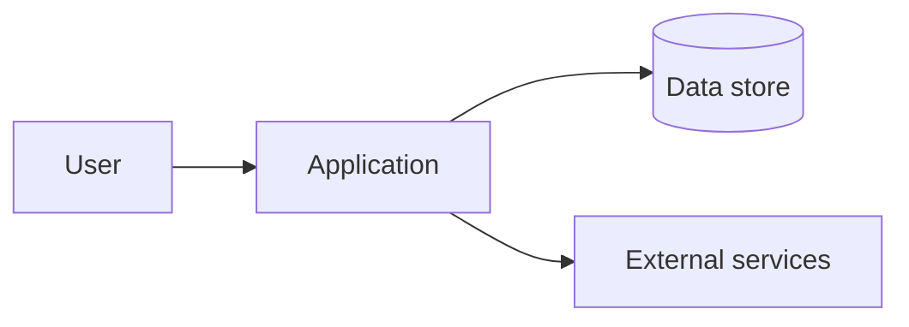

# Architecture

> Layer 3 — Environment. The map of how this project is built. Read before
> changing anything structural; update after changing anything structural.

## System overview
_One paragraph: what the system is and how the major pieces fit together._

## Diagram
_A simple ASCII or Mermaid diagram beats a wall of prose._

## Components

| Component | Responsibility | Key files / location | Talks to |
|-----------|----------------|----------------------|----------|
|           |                |                      |          |

## Data
- **Sources:**
- **Stores:**
- **Sensitive data & where it lives:** _(cross-check `guardrails/never-do.md`)_

## External dependencies
| Dependency | Used for | Failure behaviour |
|------------|----------|-------------------|
|            |          |                   |

## Boundaries & invariants
_Things that must stay true. Violating one is a bug even if tests pass._
-

## Known constraints
_Performance ceilings, scaling limits, things that are deliberately simple for now._
-
